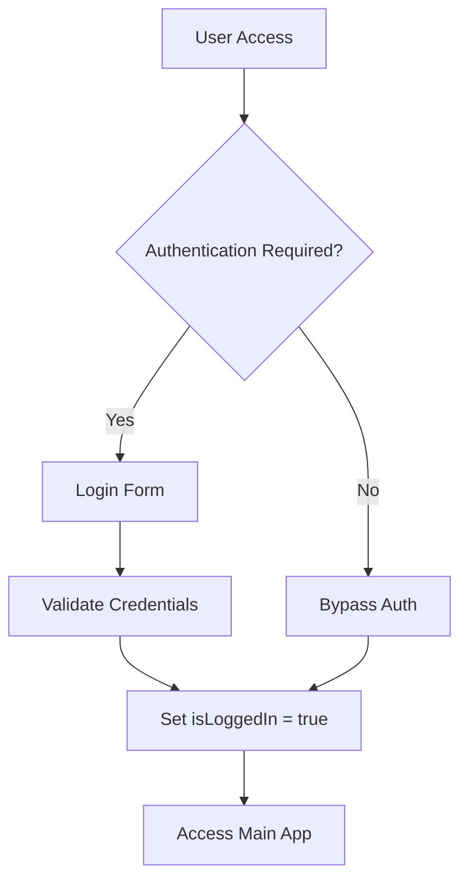
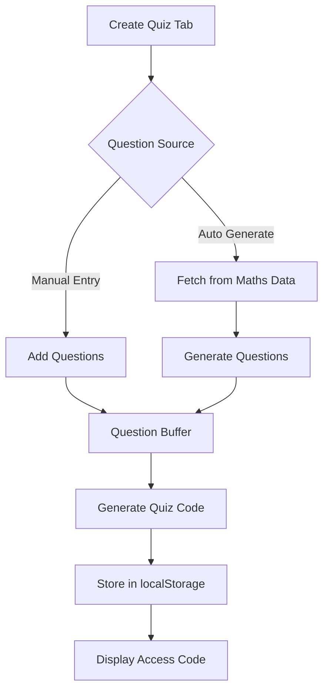
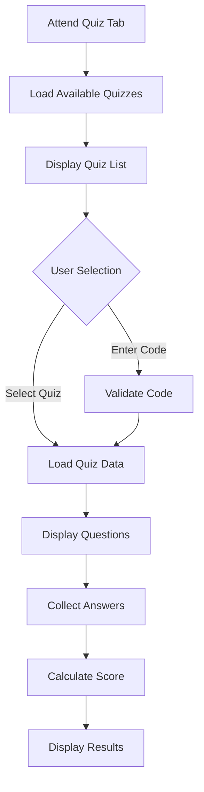
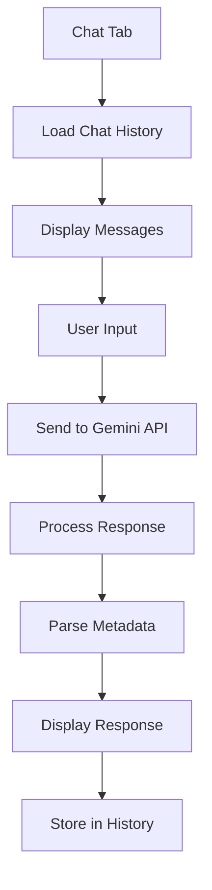

# Fixit - Mathematical Learning Platform - Complete Architecture Documentation

## 📋 Table of Contents
1. [Overview](#overview)
2. [Application Structure](#application-structure)
3. [Data Flow Architecture](#data-flow-architecture)
4. [Core Features](#core-features)
5. [Technology Stack](#technology-stack)
6. [Component Architecture](#component-architecture)
7. [State Management](#state-management)
8. [Data Storage](#data-storage)
9. [API Integration](#api-integration)
10. [Use Cases & User Stories](#use-cases--user-stories)
11. [Deployment & Development](#deployment--development)

---

## 🎯 Overview

**Fixit** is a comprehensive mathematical learning platform designed for students and educators. It combines automated quiz generation, real-time assessment, AI-powered tutoring, and offline knowledge retrieval into a unified educational experience.

### Core Mission
- **BUILD**: Create customized mathematical assessments
- **TEST**: Attend and complete generated quizzes
- **FIX**: Get AI-powered help for complex mathematical concepts

### Target Users
- **Students**: Attend quizzes, get AI tutoring, access offline resources
- **Educators**: Create and distribute mathematical assessments
- **Self-Learners**: Access curated mathematical knowledge base

---

## 🏗️ Application Structure

```
fixit/
├── 📁 src/
│   ├── 📄 App.tsx                 # Main application component
│   ├── 📄 main.tsx               # React entry point
│   ├── 📄 index.css              # Global styles
│   ├── 📁 components/            # Reusable UI components
│   │   └── 📁 Chat/           # AI Chat components (from samajh-ai)
│   │       ├── 📄 MessageList.tsx
│   │       └── 📄 InputArea.tsx
│   ├── 📁 lib/                  # Utility functions
│   │   ├── 📄 utils.ts          # Common utilities (cn function)
│   │   └── 📄 pdfUtils.ts      # PDF processing (from samajh-ai)
│   ├── 📁 services/             # External API services
│   │   └── 📄 geminiService.ts  # AI integration (from samajh-ai)
│   ├── 📄 types.ts              # TypeScript type definitions (from samajh-ai)
│   └── 📁 data/                 # Static data
│       ├── 📄 maths_data.json   # Mathematical knowledge base
│       └── 📄 data.json        # Additional educational content
├── 📄 package.json              # Dependencies and scripts
├── 📄 vite.config.ts           # Build configuration
├── 📄 tsconfig.json            # TypeScript configuration
└── 📄 .env.example              # Environment variables template
```

---

## 🔄 Data Flow Architecture

### 1. Authentication Flow


### 2. Quiz Generation Flow


### 3. Quiz Attendance Flow


### 4. AI Chat Flow


---

## 🚀 Core Features

### 1. Quiz Management System
- **Manual Quiz Creation**: Add custom questions and answers
- **Auto-Generated Quizzes**: AI-powered question generation from mathematical knowledge base
- **Flexible Question Count**: Choose 3, 5, or 10 questions for auto-generation
- **Unique Access Codes**: 5-character alphanumeric codes for quiz access
- **Quiz Storage**: LocalStorage-based persistence

### 2. Assessment & Attendance
- **Available Quizzes List**: Browse all created quizzes
- **Direct Quiz Access**: Click to attend any available quiz
- **Custom Code Entry**: Enter specific quiz codes
- **Real-time Scoring**: Instant evaluation upon submission
- **Result Analytics**: Score display with performance metrics

### 3. AI-Powered Tutoring
- **Multi-language Support**: English, Hindi, Kannada responses
- **Contextual Learning**: PDF document analysis for context
- **Visual Generation**: AI creates educational diagrams
- **Confusion Detection**: Identifies learning barriers
- **Adaptive Responses**: Tailored explanations based on confusion type

### 4. Offline Knowledge Base
- **Search Functionality**: Keyword-based search across 4,000+ mathematical theorems
- **Curated Content**: NCERT-aligned mathematical concepts
- **Metadata Organization**: Structured by class, chapter, subtopic
- **Instant Retrieval**: No internet connection required

### 5. User Experience
- **Modern UI/UX**: Motion animations, responsive design
- **Authentication Bypass**: Quick access for development/testing
- **Session Persistence**: Maintains state across browser sessions
- **Cross-platform**: Works on desktop and mobile devices

---

## 🛠️ Technology Stack

### Frontend Framework
- **React 19.0+**: Modern component-based UI
- **TypeScript 5.8**: Type-safe development
- **Vite 6.4**: Fast development and build tooling

### Styling & UI
- **TailwindCSS 4.1**: Utility-first CSS framework
- **Lucide React**: Modern icon library
- **Motion**: Smooth animations and transitions
- **clsx + tailwind-merge**: Dynamic class management

### Backend & APIs
- **Google Gemini AI**: Advanced language model integration
- **Express.js**: Local server capabilities
- **LocalStorage**: Client-side data persistence

### Development Tools
- **ESLint**: Code quality enforcement
- **Autoprefixer**: CSS compatibility
- **TSX**: TypeScript React syntax

---

## 🧩 Component Architecture

### Main App Component (`App.tsx`)
```typescript
interface AppState {
  // Authentication
  isLoggedIn: boolean;
  authMode: 'login' | 'signup';
  
  // Navigation
  activeTab: string;
  isSidebarOpen: boolean;
  
  // Quiz Management
  newQuizQuestions: Question[];
  generatedCode: string;
  autoGenerateCount: number;
  
  // Quiz Attendance
  attendCode: string;
  activeQuiz: QuizData | null;
  userAnswers: string[];
  quizResult: { score: number, total: number } | null;
  availableQuizzes: QuizData[];
  
  // Offline Mode
  offlineSearch: string;
  offlineResult: any[];
  
  // AI Chat
  chatInput: string;
  chatMessages: Message[];
  isThinking: boolean;
}
```

### Key UI Components

#### 1. Navigation System
- **Sidebar**: Collapsible navigation with tab management
- **SidebarItem**: Individual navigation items with active states
- **Logo Component**: Scalable branding element

#### 2. Quiz Components
- **Create Quiz Form**: Manual question entry with validation
- **Auto-Generate Controls**: Question count selection
- **Question Buffer**: Dynamic question list management
- **Quiz Cards**: Interactive quiz selection interface
- **Assessment Interface**: Question display with answer input
- **Results Modal**: Score display with animations

#### 3. AI Chat Components (from samajh-ai)
- **MessageList**: Chat history with typing indicators
- **InputArea**: Multi-language input with file support
- **Typing Animation**: Real-time response indicators

#### 4. Knowledge Base Components
- **Search Interface**: Real-time filtering of mathematical content
- **Result Cards**: Structured display of educational content
- **Metadata Display**: Chapter and topic information

---

## 💾 State Management

### Local State (useState)
- **Component-level state**: Managed within individual components
- **Prop drilling**: Shared state passed through props
- **Event handlers**: User interactions update local state

### Persistent State (localStorage)
```typescript
// Quiz Storage
localStorage.setItem(`quiz_${code}`, JSON.stringify(quizData));

// Chat History
localStorage.setItem('edubuddy_v1_history', JSON.stringify(messages));

// User Preferences
localStorage.setItem('user_preferences', JSON.stringify(settings));
```

### Session State
- **Authentication status**: Persists during browser session
- **Active quiz**: Maintains current assessment state
- **Chat context**: Preserves conversation history

---

## 📊 Data Storage Architecture

### 1. Mathematical Knowledge Base
```json
{
  "meta_information": {
    "class": "8",
    "subject": "Maths", 
    "chapter": "Rational Numbers",
    "subtopic": "General"
  },
  "prompt": "Class: 8\nSubject: Maths\n...",
  "completion": "Rational numbers are numbers that..."
}
```

### 2. Quiz Data Structure
```typescript
interface QuizData {
  id: string;           // Unique 5-character code
  questions: Question[];  // Array of Q&A pairs
  createdAt: number;     // Timestamp for sorting
}

interface Question {
  q: string;  // Question text
  a: string;  // Answer text
}
```

### 3. Chat Message Structure
```typescript
interface Message {
  id: string;
  role: 'user' | 'assistant';
  content: string;
  timestamp: Date;
  attachments?: string[];
  imageUrl?: string;
  visualPrompt?: string;
  confusionMeta?: {
    type: 'concept' | 'calculation' | 'language' | 'none';
    explanation: string;
  };
}
```

---

## 🔌 API Integration

### Google Gemini AI Service
```typescript
// Configuration
const ai = new GoogleGenAI({ 
  apiKey: process.env.GEMINI_API_KEY || '' 
});

// System Prompt
const SYSTEM_PROMPT = `You are AI Chat from Fix It, an elegant, refined, and highly intellectual learning assistant...`;

// Response Processing
- Text extraction and cleaning
- Metadata parsing (confusion type, visual prompts)
- Multi-language support
- Image generation capabilities
```

### API Features
- **Text Generation**: Mathematical explanations and solutions
- **Visual Generation**: Educational diagrams and illustrations
- **Multi-language**: English, Hindi, Kannada responses
- **Context Awareness**: PDF document integration
- **Error Handling**: Graceful degradation on API failures

---

## 📱 Use Cases & User Stories

### Student Use Cases

#### 1. Quiz Attendance
**As a student, I want to:**
- View available quizzes and select one to attend
- Enter a quiz code if I have one
- Answer questions and see my score immediately
- Review my performance and understand mistakes

**Implementation:**
- Browse quiz list with metadata (questions, date)
- Click to attend or enter custom code
- Real-time answer validation
- Animated score display with feedback

#### 2. AI Tutoring
**As a student, I want to:**
- Ask mathematical questions in my preferred language
- Upload PDF documents for context-specific help
- Get visual explanations for complex concepts
- Receive step-by-step problem solutions

**Implementation:**
- Multi-language chat interface
- PDF upload and processing
- Visual diagram generation
- Conversation history persistence

#### 3. Offline Learning
**As a student, I want to:**
- Search mathematical concepts without internet
- Access NCERT-aligned content
- Find specific topics and theorems
- Study offline with comprehensive resources

**Implementation:**
- Local search across 4,000+ items
- Keyword-based filtering
- Structured content display
- No internet dependency

### Educator Use Cases

#### 1. Quiz Creation
**As an educator, I want to:**
- Create custom quizzes for my students
- Auto-generate questions from curriculum
- Set unique access codes for each quiz
- Track quiz creation and distribution

**Implementation:**
- Manual question/answer entry
- AI-powered generation from knowledge base
- Automatic code generation
- LocalStorage persistence

#### 2. Assessment Management
**As an educator, I want to:**
- View all created quizzes and their metadata
- Share quiz codes with students
- Monitor quiz activity (future feature)
- Export quiz data (future feature)

**Implementation:**
- Quiz list with creation dates
- Code-based sharing system
- Metadata display (question count, etc.)

---

## 🚀 Deployment & Development

### Development Environment
```bash
# Install dependencies
npm install

# Start development server
npm run dev

# Build for production
npm run build

# Preview production build
npm run preview
```

### Environment Variables
```env
# AI Configuration
GEMINI_API_KEY=your_gemini_api_key_here

# Server Configuration
VITE_PORT=3000
VITE_HOST=0.0.0.0
```

### Build Configuration
- **Vite**: Modern build tool with HMR
- **TypeScript**: Strict type checking
- **TailwindCSS**: PostCSS processing
- **React 19**: Latest features and optimizations

### Production Deployment
1. **Static Hosting**: Deploy `dist/` folder to any static host
2. **CDN Integration**: Assets optimized for global delivery
3. **Environment Setup**: Configure production API keys
4. **Browser Compatibility**: Modern browsers with ES6+ support

---

## 🔧 Development Guidelines

### Code Standards
- **TypeScript**: Strict mode enabled
- **ESLint**: Consistent code formatting
- **Component Structure**: Functional components with hooks
- **State Management**: Predictable state updates

### Performance Considerations
- **Lazy Loading**: Components loaded on demand
- **Local Storage**: Efficient data persistence
- **API Caching**: Response optimization
- **Bundle Splitting**: Code optimization

### Security Best Practices
- **API Keys**: Environment variable storage
- **Input Validation**: Sanitization of user inputs
- **XSS Prevention**: Safe HTML rendering
- **Data Privacy**: Local-only storage by default

---

## 📈 Future Enhancements

### Planned Features
1. **Multi-user Support**: Account system with profiles
2. **Cloud Sync**: Cross-device data synchronization
3. **Advanced Analytics**: Detailed performance metrics
4. **Collaborative Learning**: Study groups and sharing
5. **Gamification**: Points, badges, and achievements
6. **Mobile App**: Native iOS/Android applications

### Scalability Considerations
- **Database Migration**: From localStorage to indexedDB
- **API Optimization**: Response caching and batching
- **CDN Integration**: Global content delivery
- **Microservices**: Modular backend architecture

---

## 📞 Support & Maintenance

### Troubleshooting Common Issues
1. **Import Errors**: Check JSON file formatting
2. **API Failures**: Verify environment variables
3. **Build Issues**: Clear node_modules and reinstall
4. **State Loss**: Check localStorage quota
5. **Performance**: Monitor bundle size and loading times

### Development Workflow
1. **Feature Branches**: Isolated development
2. **Code Review**: Peer review before merge
3. **Testing**: Unit and integration tests
4. **Documentation**: Update this file with changes
5. **Deployment**: Staged releases with rollback

---

*Last Updated: May 4, 2026*
*Version: 1.0.0*
*Architecture: React + TypeScript + Vite*

---

## 🎯 Quick Start Guide

### For Developers
1. Clone the repository
2. Run `npm install` to install dependencies
3. Copy `.env.example` to `.env` and add API keys
4. Run `npm run dev` to start development server
5. Open `http://localhost:3000` in browser

### For Users
1. Access the deployed application
2. Click "Bypass Authentication" for quick access
3. Use "Create Quiz" to generate assessments
4. Use "Attend Quiz" to take assessments
5. Use "AI Chat" for tutoring help
6. Use "Local Docs" for offline learning

---

**Fixit** - Transforming mathematical education through intelligent technology and thoughtful design.
